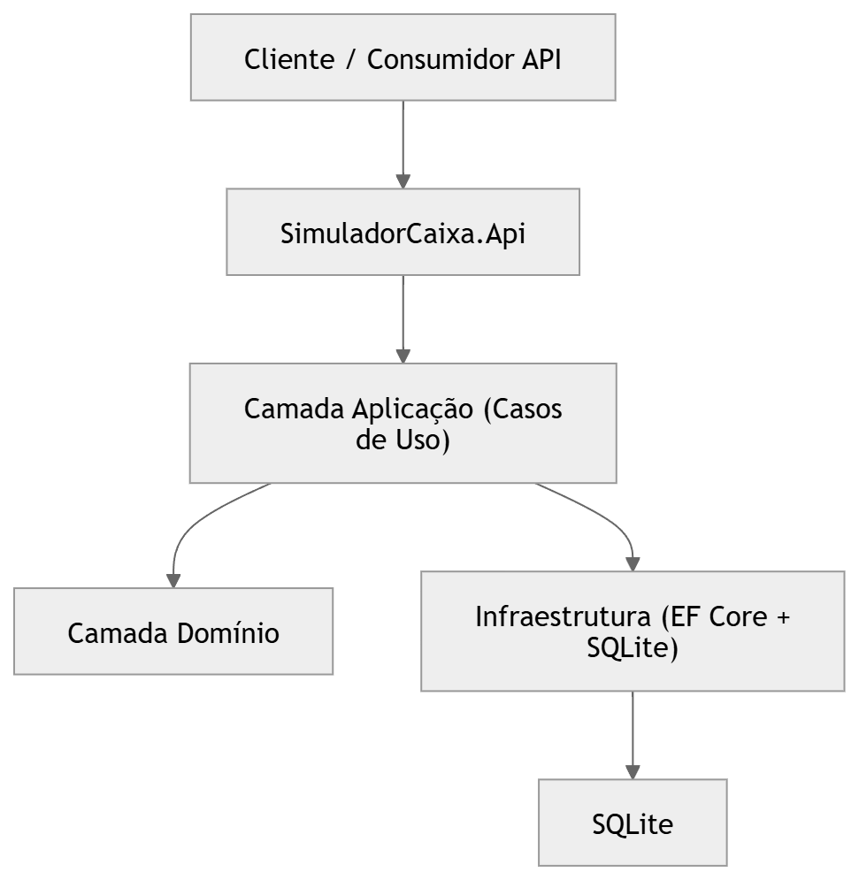

# SimuladorCaixa

## Pré-requisitos

- [.NET 9](https://dotnet.microsoft.com/download)

- [Docker](https://www.docker.com/)

## Esquema de Arquitetura

## Tomadas de decisões e Escolhas

`Clean Architecture`

O projeto foi estruturado utilizando Clean Architecture para garantir:

- separação de responsabilidades

- baixo acoplamento entre camadas

- facilidade de testes

- independência da infraestrutura

`JWT`

Foi implementada autenticação utilizando JWT Bearer Token.

Fluxo:

- Usuário obtém token via endpoint /auth/token

- Token é utilizado para acessar endpoints protegidos.

`Logs Estruturados`

O projeto implementa logs estruturados utilizando ILogger, permitindo rastreamento de eventos importantes como:

- autenticação

- criação de simulação

- consultas

- regras de negócio

`Produtos de Investimento Cadastrados`

Durante a inicialização da aplicação, um processo de seed do banco de dados cadastra automaticamente alguns produtos de investimento utilizados nas simulações.

Os produtos disponíveis são:

| ID | Produto | Tipo | Rentabilidade Anual | Risco | Prazo (meses) | Valor Mínimo | Valor Máximo |
|----|--------|------|--------------------|------|---------------|-------------|-------------|
| 1 | CDB Caixa Premium | CDB | 12% | Médio | 6 - 36 | R$ 5.000 | R$ 500.000 |
| 2 | LCI Caixa | LCI | 9,5% | Baixo | 6 - 36 | R$ 2.000 | R$ 300.000 |
| 3 | LCA Caixa Agro | LCA | 9,8% | Baixo | 6 - 48 | R$ 2.000 | R$ 400.000 |
| 4 | Tesouro Selic Simulado | Tesouro | 11% | Baixo | 1 - 60 | R$ 100 | R$ 1.000.000 |

## Como executar em ambiente local

1. Acesse a pasta do projeto
   
`cd SimuladorCaixa`

2. Restaurar pacotes comando:
    
`dotnet restore`

3. Executar a API comando: 

`dotnet run --project SimuladorCaixa.Api`

4. Acessar documentação da API

Após iniciar a aplicação, acessar no navegador:

`http://localhost:"porta"/swagger`

## Autenticação

1. Para acessar os endpoints protegidos, primeiro gere um token.

Endpoint

`POST /auth/token`

JSON

Body

{

  "usuario": "admin",
  
  "senha": "admin"

}

2. No Swagger clique em Authorize e informe:

`Bearer <seu_token>`

## Utilização dos Endpoints
1. Criar Simulação

Endpoint responsável por registrar uma nova simulação de investimento.

`POST /simulacoes`

Exemplo de requisição:

{

  "clienteId": 123,
  
  "valor": 10000,
  
  "prazoMeses": 12,
  
  "tipoProduto": 1

}

Possíveis respostas

Status	Descrição

`201`	Simulação criada com sucesso

`400`	Erro de validação

`401`	Usuário não autenticado

`422`	Nenhum produto elegível encontrado

2. Consultar Simulações de um Cliente

Retorna o histórico de simulações realizadas por um cliente.

`GET /simulacoes?clienteId=123`

Exemplo de resposta

{

    "simulacaoId": 1,
    
    "clienteId": 123,
    
    "produtoId": 2,
    
    "valor": 10000,
    
    "prazoMeses": 12,
    
    "valorFinal": 11200,
    
    "dataSimulacaoUtc": "2026-03-04T15:00:00Z"
    
  }
  

3. Consultar Dados Agregados

Retorna estatísticas das simulações de um cliente.

`GET /simulacoes/agregadas?clienteId=123`

Exemplo de resposta:

{

  "clienteId": 123,
  
  "totalSimulacoes": 2,
  
  "valorTotalInvestido": 20000,
  
  "valorTotalProjetado": 22600,
  
  "ganhoTotal": 2600,
  
  "rentabilidadeMedia": 0.13
  
}

## Testes

Para rodar os testes automatizados:

`dotnet test`

Os testes incluem:

- testes unitários

- testes de integração dos endpoints

## Executar com Docker
- Build da imagem comando:
   
`docker build -t simuladorcaixa-api .`

- Executar container comando: 

`docker run --rm -p 8080:8080 simuladorcaixa-api`

Swagger disponível em:

"http://localhost:8080/swagger"

